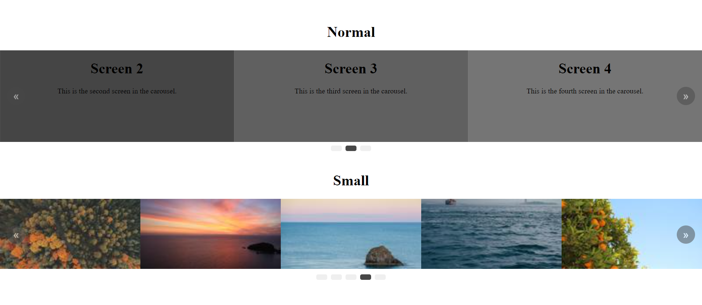

# Easy Carousel


> Easy-Carousel rodando simultâneamente em um página web.



## ✨Funcionalidades
Carrossel simples, funcional e editável, sem que você precise perder horas estudando como funciona tudo, ou mexendo nos códigos.
- Não precisa de configuração JS.
- Gestos (swipe mobile, arrastar o mouse e setas do teclado).
- Responsivo (basta configurar o CSS).
- Funcionamento individual, podendo utilizar mais de 1 carrossel por página.
- Super leve, atualizado e sem dependências.

## 💻 Pré-requisitos
O carrossel é feito apenas com HTML5, CSS3 e JS puro, não é necessário nada além disso, certifique-se apenas de:
- Utilizar um navegador atualizado.
- Possuir um editor de código para edição.

## 🚀 Instalando o Easy-Carousel
Para utilizar o carrossel, siga estas etapas:

1. Clone este repositório.
2. Adicione o arquivo CSS e JS dentro do seu projeto.

## ☕ Configurando o Easy-Carousel
Para configurar a ferramenta, siga estas etapas (Utilize o arquivo HTML como base para começar):

1. Copie o bloco `"CAROUSEL-CONTAINER"` e tudo o que dentro estiver dele.
```html
<div class="carousel-container">
  <!-- COPIAR TODO O CONTEÚDO PRESENTE AQUI -->
</div>
```

2. Altere apenas o que estiver dentro da tag `"CAROUSEL-SLIDE"`, você pode repeti-lá quantas vezes preferir e colocar o que quiser dentro.
```html
<div class="carousel-slider">

    <div class="carousel-slide">
        <!-- LIVRE PARA CODAR -->
    </div>
    <div class="carousel-slide">
        <!-- O CARROSSEL SE ADAPTA AO TAMANHO DO CONTEUDO -->
    </div>
    <div class="carousel-slide">
        <!-- COLOQUE O QUE VOCÊ QUISER -->
    </div>

</div>
```

3. Declare (com `"MIN_WIDTH"`), no arquvio CSS, a porcentagem do tamanho da classe `".CAROUSEL_SLIDE"` de acordo com quantas DIVS devem ser exibidas, incluindo no mobile.

> 4 slides desktop e 1 slide no mobile:
```css
.carousel-slide{
    /* 100/4= 25 */
    min-width: 25%;
}

@media (max-width: 425px) {
  .carousel-slide {
    /* 100/1= 100 */
        min-width: 100%;
    }
}
```

> 6 slides desktop e 3 slides no mobile:
```css
.carousel-slide{
    /* 100/6= 16.66... */
    min-width: 16.66%;
}

@media (max-width: 425px) {
    .carousel-slide {
        /* 100/3= 33.33... */
        min-width: 33.33%;
    }
}
```

4. Referencie uma nova classe EasyCarousel indicando o container do seu carrosel (para mais de um carrossel, repita os passos acima dentro de um `CAROUSEL-CONTAINER` diferente, você pode chamar como quiser, desde que sua estrutura interna siga o padrão).
```html
<!-- PRIMEIRO CARROSSEL -->
<div class="carousel-container">
  ...
</div>

<!-- SEGUNDO CARROSSEL -->
<div class="carousel-container small">
  ...
</div>
```
```html
<script src="assets/carousel.js"></script>
<script defer>
    new EasyCarousel(document.querySelector('.carousel-container'))
    new EasyCarousel(document.querySelector('.carousel-container.small'))
</script>
```

- Caso queira utilizar um estilo diferente para cada carrossel, basta adicionar algo a mais nas tags `CAROUSEL-SLIDE` e configurar como desejar no CSS.
```html
<!-- PRIMEIRO CARROSSEL -->
<div class="carousel-container">
  ...
    <div class="carousel-slide">
        ...
    </div>
  ...
</div>

<!-- SEGUNDO CARROSSEL -->
<div class="carousel-container small">
  ...
    <div class="carousel-slide small">
        ...
    </div>
  ...
</div>
```
```css
.carousel-slide {
    min-width: 50%;
}

.carousel-slide.small {
    min-width: 20%;
}

@media (max-width: 425px) {
    .carousel-slide {
        min-width: 100%;
    }

    .carousel-slide.small {
        min-width: 50%;
    }
}
```

## 📫 Contribuindo para o Easy-Carousel
Para contribuir com o projeto, siga estas etapas:

1. Bifurque este repositório.
2. Crie um branch: `git checkout -b <nome_branch>`.
3. Faça suas alterações e confirme-as: `git commit -m '<mensagem_commit>'`
4. Envie para o branch original: `git push origin <nome_do_projeto> / <local>`
5. Crie a solicitação de pull.

Como alternativa, consulte a documentação do GitHub em [como criar uma solicitação pull](https://help.github.com/en/github/collaborating-with-issues-and-pull-requests/creating-a-pull-request).

## 🤝 Colaboradores
Agradecemos às seguintes pessoas que contribuíram para este projeto:

<table>
  <tr>
    <td align="center">
      <a href="https://github.com/YaGRRusso">
        <br>
        <sub>
          <b>Yago Russo</b>
        </sub>
      </a>
    </td>
  </tr>
</table>

## 📝 Licença
Esse projeto está sob licença. Veja o arquivo [LICENÇA](LICENSE) para mais detalhes.

[⬆ Voltar ao topo](#easy-carousel)<br>